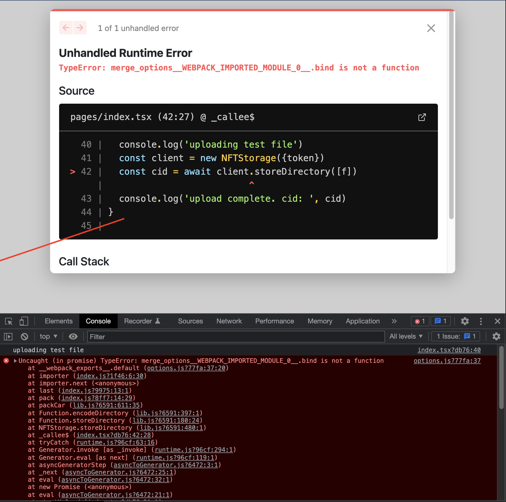

This is a minimal reproduction case for https://github.com/nftstorage/nft.storage/issues/929.

# usage

1. Make a file called `.env.local` and add your nft.storage API key:

```
NEXT_PUBLIC_NFT_STORAGE_TOKEN="your token here"
```

1. install deps

```
npm install
```

1. run the dev server

```
npm run dev
```

1. Open the site, open devtools, press the "press me" button



